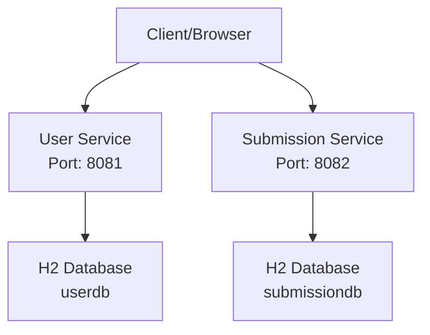
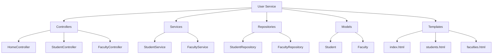
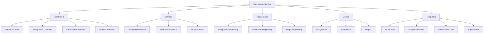
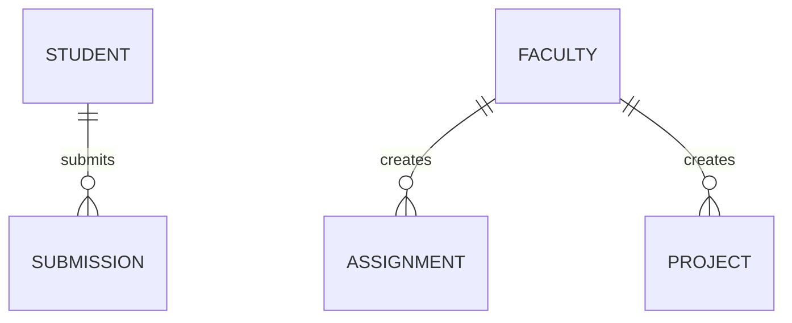
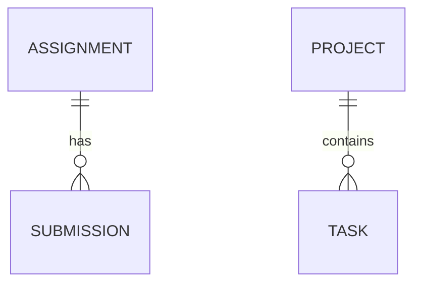

# Project Structure Diagram

## Overall Architecture

## User Service Structure

## Submission Service Structure

## Entity Relationships

### User Service Entities

### Submission Service Entities

Note: The TASK entity was mentioned in the requirements but not implemented as a separate entity. It could be implemented as part of the Project entity or as a separate entity in future enhancements.