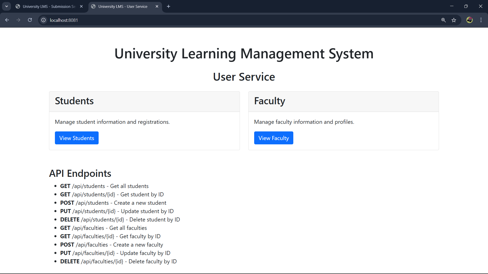
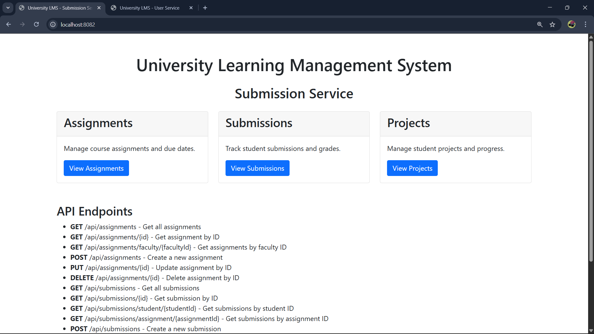

# University Learning Management System

A Spring Boot-based web application to manage assignment submissions and project tracking for students and faculty.

## Project Structure

This project follows a microservices architecture with two main services:

1. **User Service** (Port: 8081)
   - Handles user management (students and faculty)
   - Manages registration and role management

2. **Submission Service** (Port: 8082)
   - Manages assignments, submissions, and project tracking

## Technologies Used

- Spring Boot 3.3.4
- Spring Data JPA
- H2 Database (In-memory)
- Maven
- JUnit 5 & Mockito for testing

## Entity Relationships

### User Service
- Student (id, name, email, department)
- Faculty (id, name, email, department)

### Submission Service
- Assignment (id, title, description, dueDate, facultyId)
- Submission (id, studentId, assignmentId, fileUrl, submittedDate, status)
- Project (id, title, description, facultyId, progressStatus, deadline)

## REST API Endpoints

### User Service

#### Student Endpoints
- `GET /api/students` - Get all students
- `GET /api/students/{id}` - Get student by ID
- `POST /api/students` - Create a new student
- `PUT /api/students/{id}` - Update student by ID
- `DELETE /api/students/{id}` - Delete student by ID

#### Faculty Endpoints
- `GET /api/faculties` - Get all faculties
- `GET /api/faculties/{id}` - Get faculty by ID
- `POST /api/faculties` - Create a new faculty
- `PUT /api/faculties/{id}` - Update faculty by ID
- `DELETE /api/faculties/{id}` - Delete faculty by ID

### Submission Service

#### Assignment Endpoints
- `GET /api/assignments` - Get all assignments
- `GET /api/assignments/{id}` - Get assignment by ID
- `GET /api/assignments/faculty/{facultyId}` - Get assignments by faculty ID
- `POST /api/assignments` - Create a new assignment
- `PUT /api/assignments/{id}` - Update assignment by ID
- `DELETE /api/assignments/{id}` - Delete assignment by ID

#### Submission Endpoints
- `GET /api/submissions` - Get all submissions
- `GET /api/submissions/{id}` - Get submission by ID
- `GET /api/submissions/student/{studentId}` - Get submissions by student ID
- `GET /api/submissions/assignment/{assignmentId}` - Get submissions by assignment ID
- `POST /api/submissions` - Create a new submission
- `PUT /api/submissions/{id}` - Update submission by ID
- `DELETE /api/submissions/{id}` - Delete submission by ID

#### Project Endpoints
- `GET /api/projects` - Get all projects
- `GET /api/projects/{id}` - Get project by ID
- `GET /api/projects/faculty/{facultyId}` - Get projects by faculty ID
- `POST /api/projects` - Create a new project
- `PUT /api/projects/{id}` - Update project by ID
- `DELETE /api/projects/{id}` - Delete project by ID

## Running the Application

### Option 1: Using the provided scripts (Recommended)

We provide several scripts to help you build and run the application:

1. **Build the project** (compiles and packages into JAR files):
   - Windows: `build-project.bat`
   - Linux/Mac: `chmod +x build-project.sh && ./build-project.sh`

2. **Run services using Maven** (requires Maven to be installed):
   - Windows: `run-services.bat`
   - Linux/Mac: `chmod +x run-services.sh && ./run-services.sh`

3. **Run services from JAR files** (after building the project):
   - Windows: `run-jars.bat`
   - Linux/Mac: `chmod +x run-jars.sh && ./run-jars.sh`

### Option 2: Manual execution

1. Navigate to each service directory:
   ```
   cd user-service
   mvn spring-boot:run
   
   cd submission-service
   mvn spring-boot:run
   ```

2. Or build and run the JAR files:
   ```
   mvn clean package
   java -jar user-service/target/user-service-0.0.1-SNAPSHOT.jar
   java -jar submission-service/target/submission-service-0.0.1-SNAPSHOT.jar
   ```

### Troubleshooting

If you encounter issues:

1. **Find Maven installation**: `find-maven.bat` (Windows) or `find-maven.ps1` (PowerShell)
2. **Add Maven to PATH**: `setup-maven-path.bat` (Windows)
3. **Check system status**: `check-status.bat` (Windows)

## Testing

Run unit tests with:
```
mvn test
```

## Database

Both services use H2 in-memory databases for development:
- User Service H2 Console: http://localhost:8081/h2-console
- Submission Service H2 Console: http://localhost:8082/h2-console

JDBC URL: jdbc:h2:mem:testdb
Username: sa
Password: (empty)

## Architecture

This application follows the Three-Tier Architecture pattern extended to a Microservices architecture:

1. **Presentation Layer** - REST Controllers
2. **Business Logic Layer** - Services
3. **Data Access Layer** - Repositories

Each microservice can be developed, tested, and deployed independently.

## Images

- `images/user service.png` — User Service UI (students/faculties)
- `images/submission-service.png` — Submission Service UI (assignments/submissions)

Embedded previews (these will show up on GitHub if the files exist):





If you don't have these files yet, add images to the `images/` folder and commit them. On Windows PowerShell you can copy images into the folder with a command like:

```powershell
Copy-Item -Path C:\path\to\your\image.png -Destination .\images\
```

Alternatively, add images using File Explorer by copying them into the `images` folder at the repository root.

